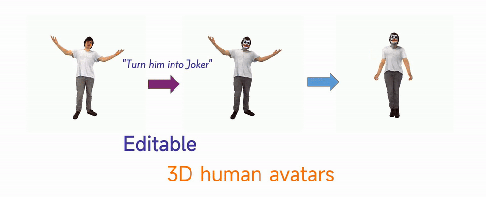

<div align="center">
   <h1 align="center">
    <strong>InstructHumans</strong> <br>
    Editing Animated 3D Human Textures with Instructions 
   </h1>

   <p>
      <a href="https://jyzhu.top/instruct-humans/data/InstructHumans.pdf" target="_blank"></a>
      <a href=https://arxiv.org/abs/2404.04037 target="_blank"></a>
      <a href="https://jyzhu.top/instruct-humans/" target="_blank"></a>
      <br>
      <a href="https://wakatime.com/badge/user/7974bf3e-99a6-4d26-8e4b-38ca6d5c9c64/project/f1416cf1-e536-442f-ac24-15d02a21d2c1"></a>
      
      
   </p>
</div>

<p align="center">
  <a href="https://jyzhu.top/" target="_blank">Jiayin Zhu</a><sup>1</sup>,&nbsp;
  <a href="https://www.mu4yang.com/" target="_blank">Linlin Yang</a><sup>2</sup>,&nbsp;
  <a href="https://www.comp.nus.edu.sg/~ayao/" target="_blank">Angela Yao</a><sup>1,&#x2709</sup>;</a>
  <br>
  <a href="https://cvml.comp.nus.edu.sg" target="_blank">Computer Vision & Machine Learning Group</a>, National University of Singapore <sup>1</sup>
  <br/>
  Communication University of China <sup>2</sup>
  <br/>
  <sup>&#x2709;</sup> Corresponding Author
</p>


## 📑 Abstract
<p align="center">
   InstructHumans edits 3D human textures with instructions. 
   It maintains avatar consistency and enables easy animation.
  
</p>


## 📍 InstructHumans Results
   <h3 align="center">
    Editing gallery
   </h3>

*Left to right: Original, "Turn the person into a clown",
"Turn the person into Lord Voldemort",
"Put the person in a suit",
"A bronze statue".*


InstructHumans produce high-fidelity editing results, that align with editing instructions, while faithfully preserving the details of original avatars.
   <h3 align="center">
    Animation
   </h3>

Edited avatars can be easily animated!


## 📦 Installation

Our code has been tested with PyTorch 2.0.1, CUDA 11.7. But other versions should also be fine.

- Clone this repo and create conda environment:

    ```bash
    git clone https://github.com/viridityzhu/InstructHumans.git
    cd InstructHumans
    conda env create -f environment.yml
    conda activate InstructHumans
    ```

- `kaolin` requires to be installed separately. Check their docs - [Installation](https://kaolin.readthedocs.io/en/latest/notes/installation.html). They provided prebuilt wheels for some older versions of CUDA and pytorch.

    ```sh
    TORCH_VER="2.0.1"
    CUDA_VER="117"
    pip install kaolin==0.14.0 -f https://nvidia-kaolin.s3.us-east-2.amazonaws.com/torch-$TORCH_VER\_cu$CUDA_VER\.html
    ```

    <details>
    <summary>Click me for issues with kaolin installation</summary>

    If you encounter error when importing kaolin: `from kaolin import _C ImportError`, it may due to incompatibility with your CUDA version.

    Note we use cuda version 11.7. Try install the specific version in the conda environment:

    ```bash
    conda install -c conda-forge cudatoolkit=11.7
    ```

    Alternatively, you can install the compatible versions all together:
    ```bash
    conda install pytorch==2.0.1 torchvision==0.15.2 torchaudio==2.0.2 pytorch-cuda=11.7 -c pytorch -c nvidia
    ```

    Then, reinstall kaolin with `--force` option.

    </details>

## 📂 Data preparation

1. Download the CustomHumans dataset [here](https://forms.gle/oY4PKUyhH6Qqd5YA9). We use their provided pretrained checkpoint. Put it into the `checkpoints` folder in the following structure:

```sh
checkpoints/demo/model-1000.pth
```

2. Download [SMPL-X](https://smpl-x.is.tue.mpg.de/) models and move them to the `smplx` folder in the following structure:

```sh
    smplx
    ├── SMPLX_NEUTRAL.pkl
    ├── SMPLX_NEUTRAL.npz
    ├── SMPLX_MALE.pkl
    ├── SMPLX_MALE.npz
    ├── SMPLX_FEMALE.pkl
    └── SMPLX_FEMALE.npz
```

## 🎲 3D Human Editing

### Checkpoints

In [google drive link](https://drive.google.com/file/d/1OjrEhHrExD0egPQdkn3S8ll4PltFkfzS/view?usp=sharing), we provide our pre-trained checkpoints, pre-processed data, and an example animation motion.

### Pre-process

This pre-process helps speed up the editing. In the previous link, we provide a prepared data file for human id 32 for a quick start.

The data file can be specified by `--traced_points_data_root prepared_tracing.h5` when editing.

To prepare the data for other human IDs, use the following:

```bash
python -m tools.prepare_tracing --subject_list [9,15]
```

`--subject_list []` specifies subject ids to be processed. Processing one subject takes around 30 minutes. (This will pre-sample intermediate results of ray tracing for each human subject and cache them in a h5 file. This way, we can avoid repeating ray tracing and extremely speed up the editing procedure.)


### Edit human with instructions

Run the below command, and you will edit the sample human (id 32 in the dataset) into a clown:

```sh
python edit.py --instruction "Turn him into a clown" --id 32
```
Here are some configuration flags you can use; otherwise you can find full default settings in `config.yaml` and descriptions in `lib/utils/config.py`:

* `--instruction`: textual editing instruction.
* `--id`: human subject index. Use this to indicate the original human to be edited. They should be included in the pretrained checkpoints of CustomHumans.
* `--save-path`: path to the folder to save the checkpoints.
* `--config`: path to the config file. The default is `config.yaml`
* `--wandb`: we use wandb for monitoring the training. Activate this flag if you want to use it.
* `--caption_ori` and `--caption_tgt`: these do not affect the editing, but help calculate evaluation metrics. They are captions describing the original or target images.
* `--sampl_strategy`: to select SDS-E / SDS-E' / SDS to use, set "dt+ds" / "dt+ds2" / "ori", respectively. More details can be found in our paper.

### Test a trained checkpoint

- We provide `test/test_cp.py` to test a trained checkpoint. Usage:

```sh
python -m test.test_cp \
    --edit_checkpoint_file "checkpoints/test/elf32.pth.tar" \
    --instruction "Turn him into Tolkien Elf" \
    --id 32 \
    --caption_ori "A photo of a person" --caption_tgt "A photo of a Tolkien Elf"
    --cal-metric 1 \
    --render-more 0
```

- `--cal-metric`: whether to calculate the evaluation metrics. If wandb is disabled, the metrics are printed; otherwise, they are uploaded to wandb.
- `--render-more`: by default, for both the original and edited humans, we render 15 images for visualization, and they are saved in the same directory as the checkpoint file. You can set this to `1` if you want to render more images.
- The other supported arguments are the same as `edit.py`.

## ▶️ Demo for animating an edited human

1. Prepare SMPL-X models with desired poses. For example, you can download the [MotionX](https://github.com/IDEA-Research/Motion-X) dataset, and use `tools/load_motionx_smplx.py` to convert its SMPL-X JSON data into `.obj` files. We've provided an example motion clip in the checkpoints link.
  
    Example usage:

    ```sh
    python tools/load_motionx_smplx.py -i test/motionX_example
    ```

2. Reposing and rendering, usage:

    ```sh
    python -m test.drive_motion \
        --id 9 # subject id (only affect the geometry) \
        --load_edit_checkpoint True \
        --edit_checkpoint_file checkpoints/joker9/checkpoint_step1000.pth.tar  # texture checkpoint \
        --motion-folder test/motionX_example/Electrician_dancing # many obj files defining the motion, prepared in step 1 \
        --output-name joker9 # output folder's name \
        --n_views 4 # rendered views per frame \
    ```

    Once done, you'll get generated rendered per frame images as well as an mp4 video in `test/outputs/`.

## 📄 Citation

If you found this repository/our paper useful, please consider citing:

``` bibtex
@article{zhu2024InstructHumans,
         author={Zhu, Jiayin and Yang, Linlin and Yao, Angela},
         title={InstructHumans: Editing Animated 3D Human Textures with Instructions},
         journal={arXiv preprint arXiv:2404.04037},
         year={2024}
} 
```

## 👏 Acknowledgement

We sincerely thank the authors for their awesome works in [editable-humans](https://github.com/custom-humans/editable-humans) and [instruct-nerf2nerf](https://github.com/ayaanzhaque/instruct-nerf2nerf)!
